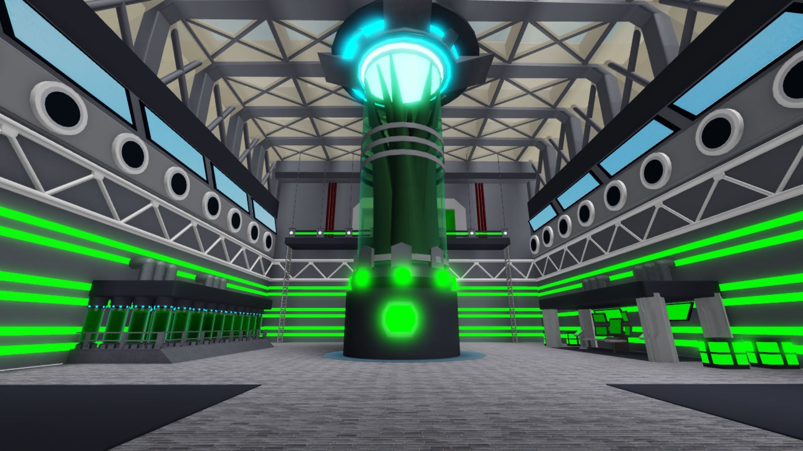
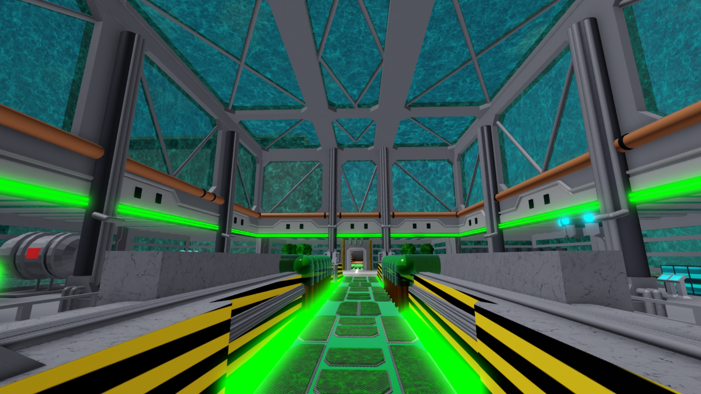
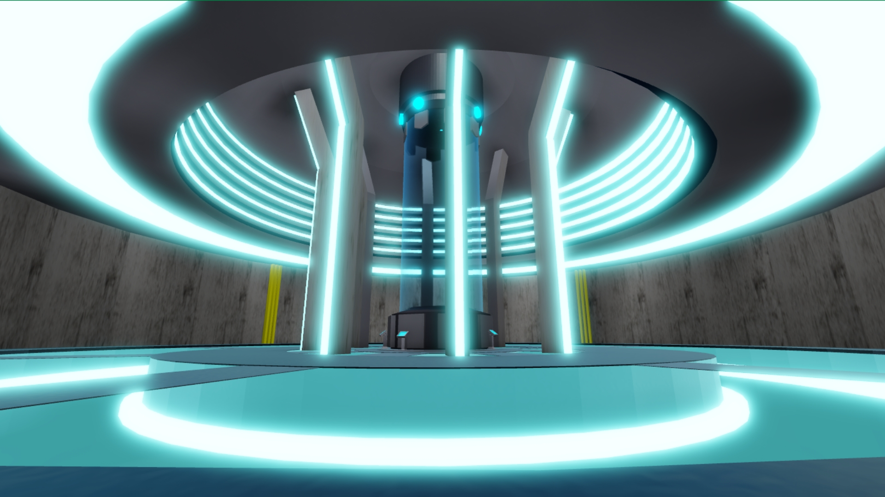
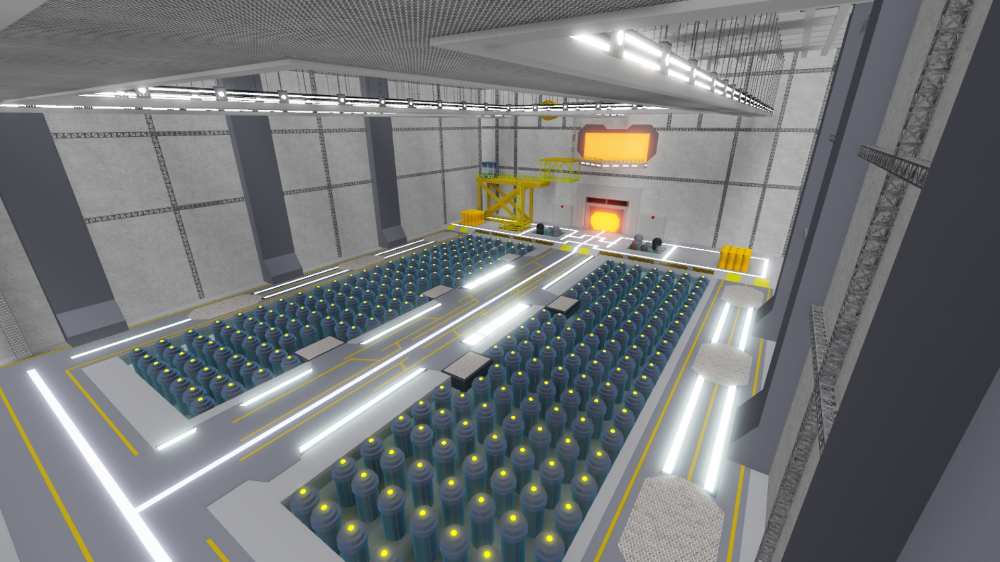
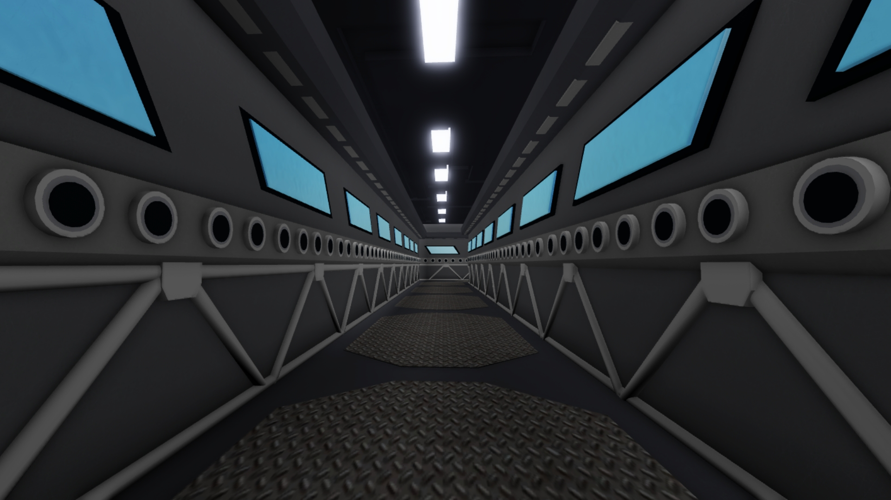
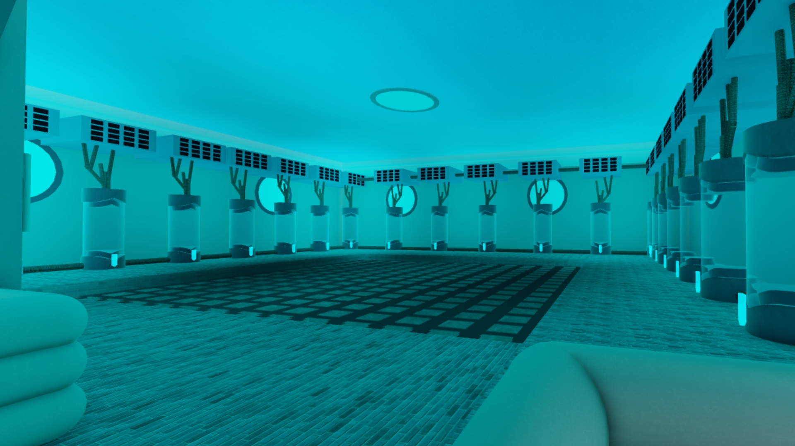
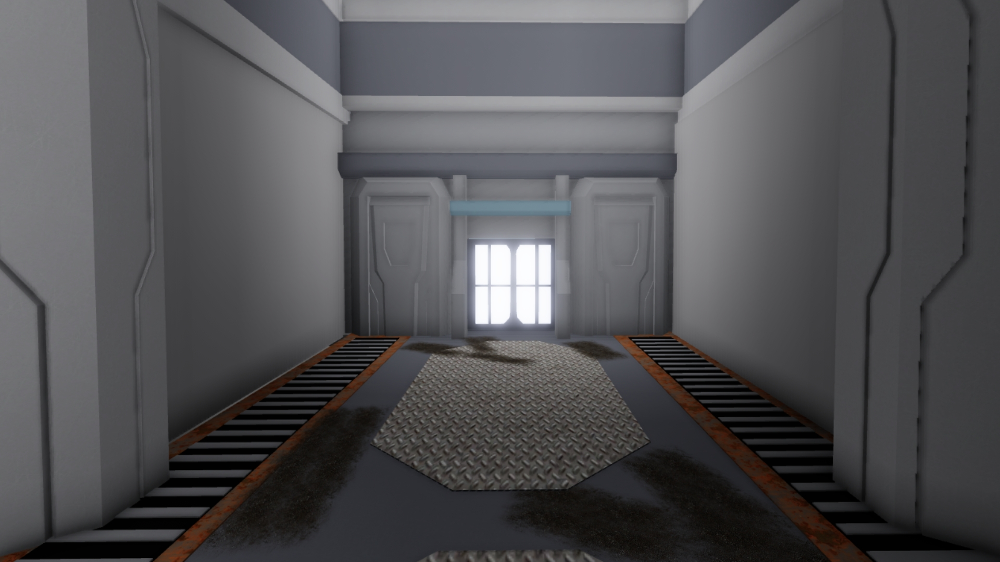

# SCP Underground Laboratory 🧪
**Game Level Design Prototype | Leader Builder & 3D Modeler**

A high-fidelity environment designed for immersive sci-fi gameplay. This project showcases advanced lighting techniques, modular design, and custom 3D assets.

---

## 📸 Project Gallery
Below are highlights of the facility's key sectors.

| Sector | Technical Highlight |
| :--- | :--- |
|  | **Central Hub:** Large-scale orientation point with complex green emissive lighting. |
|  | **Environmental Depth:** Integrated glass architecture with simulated water environments. |
|  | **Lighting Optimization:** High-contrast neon aesthetics designed for atmospheric tension. |

<b>📂 Click to view full facility tour (Extra shots)</b>

### Industrial Sectors
* 
* 

### Laboratory & Stasis
* 
* 

---

## 🛠️ Technical Specifications
* **Engine:** Roblox Studio
* **3D Modeling:** Blender (Modular Props & Architecture)
* **Lighting:** Integrated Post-Processing and Custom Emissives.

## 📂 Repository Structure
* `source/`: Contains the primary `.rbxl` project file.
* `documentation/`: High-resolution screenshots of the environment.
